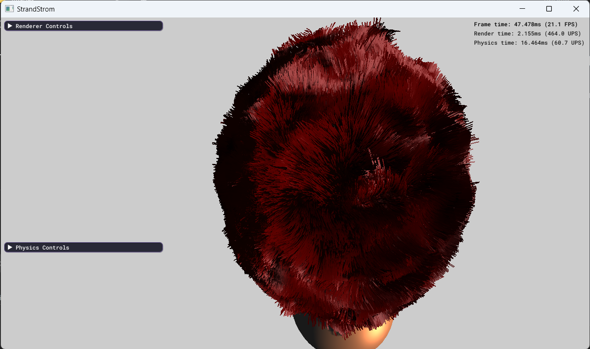
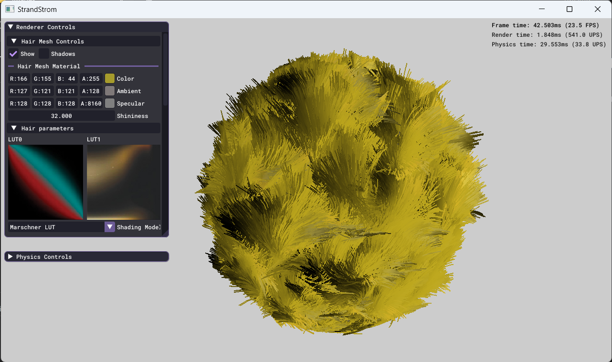
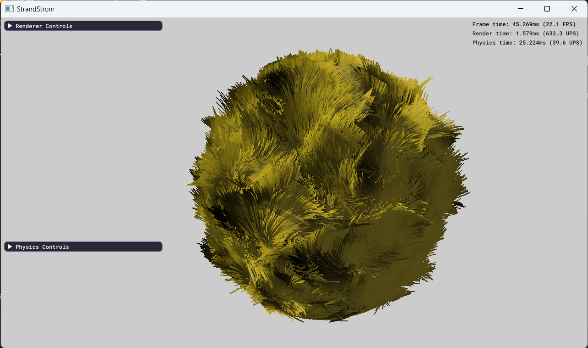

# StrandStorm
### Real-time Hair Rendering and Dynamics
 

#### Features:
- Control hair generation and interpolation [1]
- Kajiya-Kay and Marsehner et. al. shading modes [2,3]
- Hair-to-hair shadows using deep opacity maps [4]
- Physically-based simulation of strands using discrete elastic rods [5]
- Hair-to-hair and surface-to-hair collisions with lenght constraints [6]
- Basic phong shading and shadow maps for surface illmunation.

  
 

#### How to build & run:
1. Clone repository.
2. `cd` into projects root directory. 
3. `mkdir` a build directory.
4. Use CMake to configure and build into the build directory.
5. Run the executble generated.

 

#### References:

[1] M. Pharr, H. Nguyen, and W. Donnelly, “Chapter 23. Hair Animation and Rendering in the Nalu Demo,” in GPU gems 2: Programming techniques for high-performance graphics
[2] S. R. Marschner, H. W. Jensen, M. Cammarano, S. Worley, and P. Hanrahan, “Light scattering from human hair fibers,” ACM SIGGRAPH 2003 Papers, 2003. 
[3] E. d'Eon, G. Francois, M. Hill, J. Letteri, and J.-M. Aubry, “An energy-conserving hair reflectance model,” Computer Graphics Forum, vol. 30, no. 4, pp. 1181–1187, 2011. 
[4] C. Yuksel and J. Keyser, “Deep opacity maps,” Computer Graphics Forum, vol. 27, no. 2, pp. 675–680, 2008.
[5] M. Bergou, M. Wardetzky, S. Robinson, B. Audoly, and E. Grinspun, “Discrete elastic rods,” ACM SIGGRAPH 2008 papers, 2008.  and general-purpose computation, Addison-Wesley, 2006. 
[6] M. Müller, T. Kim, and N. Chentanez, ‘Fast Simulation of Inextensible Hair and Fur’, 12 2012.
[7] Millag, “Millag/discreteelasticrods: Hair simulation demo,” GitHub. [Online]. Available: https://github.com/millag/DiscreteElasticRods. [Accessed: 25-Apr-2023]. 
